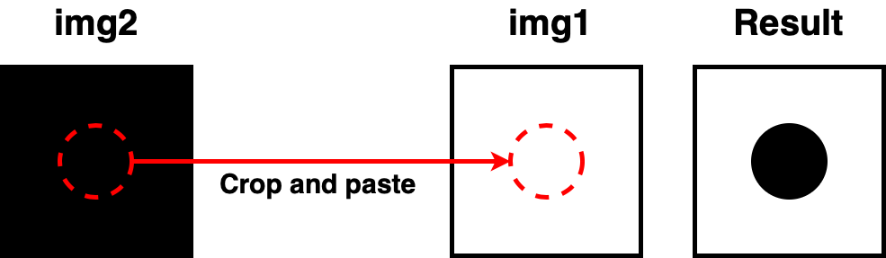

# crop_circle
Crop a circle from one image to another image by specifying the radiance and the coordinates of the source and destination.

## How to run the code:
In the terminal:
```
python3 crop_circle.py
```
## Parameters
```python
r = 50 # the radius
cx1, cy1 = 250, 250 # the center of the circle on img1
cx2, cy2 = 250, 250 # the center of the circle on img2
```
- Note: In this example, we are cropping a circle from img2.
